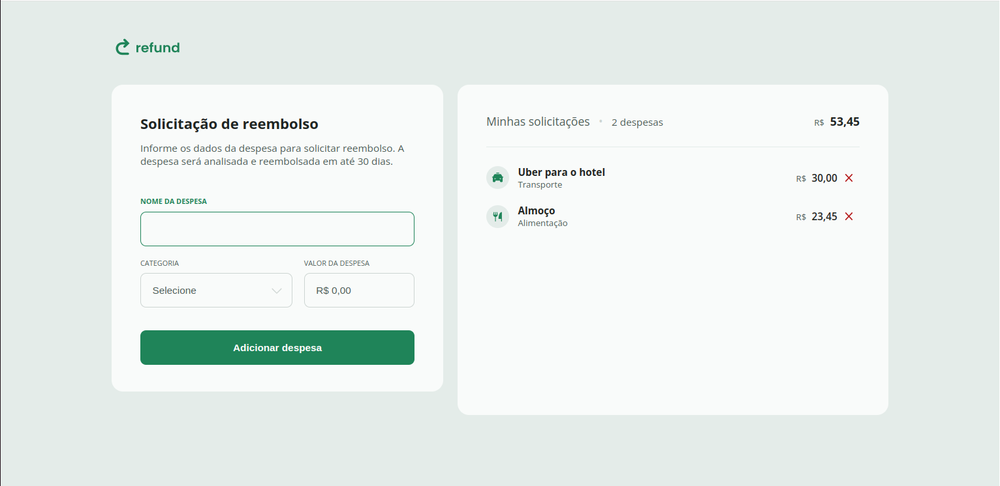

# Refund

  Projeto de solicitação de reenbolso de despesas, desenvolvido durante o módulo de javaScript intermediario do curso MBA fullstack rocketseat.
  A ideia é execitar conceitos de métodos de manipulação de texto, técnicas de repetição eficientes, manipulação de datas e horas.

# Rodando o Projeto

  Instale o plugin [Live Server](https://marketplace.visualstudio.com/items?itemName=ritwickdey.LiveServer). No canto inferior direito da tela 
  precione o botão go live para executar o projeto

